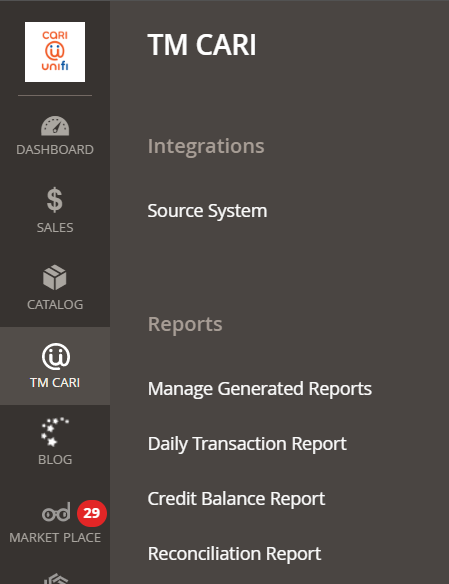
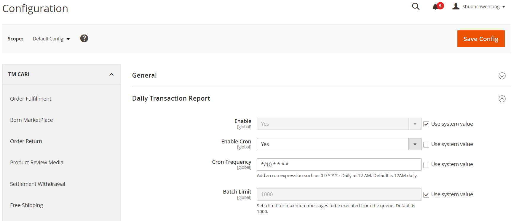

1. __Describe how the ACL works with roles and resources__
   
   Access Control List (__ACL__) defines the roles and resources. In Magento 2, __acl.xml__ is responsible for managing __ACL__.<br/> 
   The file structure of __acl.xml__ are as defined below in each modules:
   ```
    etc
    |---acl.xml
   ```
   We can indicate which files should be within control of the __ACL__ in the module.
   - In __Controller__:<br/>`const ADMIN_RESOURCE = 'Born_DailyTransactionReport::daily_transaction';`
   - In __adminhtml/menu.xml__:<br/>`<add ... resource="Born_DailyTransactionReport::daily_transaction" .../>`
   - In __adminhtml/system.xml__:<br/>`<resource>Born_Reports::reports</resource>`

   The content of __acl.xml__ is stated as below:
    ```
    <config xmlns:xsi="http://www.w3.org/2001/XMLSchema-instance" xsi:noNamespaceSchemaLocation="urn:magento:framework:Acl/etc/acl.xsd">
        <acl>
            <resources>
                <resource id="Magento_Backend::admin">
                    <resource id="Born_SourceSystem::tm_cari" title="TM CARI" sortOrder="90">
                        <resource id="Born_Reports::reports" title="Reports" sortOrder="10">
                            ...
                            <resource id="Born_DailyTransactionReport::daily_transaction" title="Daily Transaction" sortOrder="30"/>
                            ...
                        </resource>
                    </resource>
                    <resource id="Magento_Backend::stores">
                        <resource id="Magento_Backend::stores_settings">
                            <resource id="Magento_Config::config">
                                <resource id="Born_Reports::manage_reports" title="Manage Reports"/>
                                ...
                            </resource>
                        </resource>
                    </resource>
                </resource>
            </resources>
        </acl>
    </config>
    ```

    `<resource id="Magento_Backend::admin">` refers to the menu items in Magento Admin Panel while `<resource id="Magento_Backend::stores">` refers to the Backoffice System Configuration.
    <center>

    | Admin Menu  | Stores System Configuration |
    |--------|-------------|
    |  |  |
    
    </center>

    Once __ACL__ is set in place, admin can configure if the __ROLE__ have access to the __RESOURCE__.<br/>

    Head on to __System__→__Permissions__→__User Roles__ and proceed with __Add New Role__ OR __Update Existing Role(s)__.<br/>
    Under __Role Information__→__Role Resources__→__Resource Access__, admin can select either __All__ OR __Custom__.
    - __All__: Role created will have access to ALL resources.
    - __Custom__: Role created will have access to SELECTED resources ONLY.
  
    If the user does not have access to the resource, they will be redirected either Dashboard homepage or Not Found page.

2. __Identify the components to use when creating or modifying the admin grid/form__
   
    File structure for Admin Grid:
    ```
    Controller
    |--Adminhtml
        |--Transaction
            |--Index.php
    Ui
    |--DataProvider
        |--OrderReportDataProvider.php
    view
    |--adminhtml
        |--layout
            |--tmreports_transaction_index.xml
        |--ui_component
            |--tmreports_daily_txn_listing.xml
    ```

    File structure for Admin Form:
    ```
    Controller
    |--Adminhtml
        |--Reasons
            |--Add.php
            |--Delete.php
            |--Edit.php
            |--Save.php
            |--View.php
    Ui
    |--DataProvider
        |--ReasonsManager
            |--Edit.php
    view
    |--adminhtml
        |--layout
            |--reasons_manager_reasons_add.xml
            |--reasons_manager_reasons_edit.xml
            |--reasons_manager_reasons_view.xml
        |--ui_component
            |--reasons_manager_reasons_form.xml
    ```

   - __`layout`__ is the `html` structure to describe how should the content of the page be, such as `<head>` and `<body>`.
   - __`ui_component`__ is the reusable UI components to be defined in the grid or form, such as columns, filters, export, buttons and etc.
   - __`DataProvider`__ is the collection of data where the grid is depending on, or the data of the form to be edited. 
   - __`Controller`__ is responsible for rendering the layout to the client.
3. __Identify the files to use when creating a store/admin config and menu items__
   
   File structure to create system configuration and menu items are:
   ```
   etc
   |--adminhtml
        |--system.xml
        |--menu.xml
   |--config.xml
   ```
   - __`system.xml`__ defines the input fields (text, password, yesno, multiple select, etc) in __Stores__→__Settings__→__Configuration__ for the admin to manage.
   - __`config.xml`__ defines the default value for `system.xml` and also serves as fallback value if the admin chose __Use system value__.
   - __`menu.xml`__ defines the menu items on the admin panel.